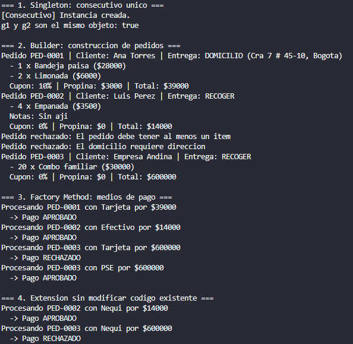
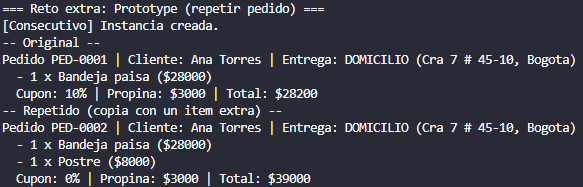

# 📚 Modelos de Programación

## 👤 Información del estudiante

| | |
|---|---|
| **Nombre** | Juan Sebastian Herrera Rodriguez |
| **Código** | 20242020032 |
| **Clase** | Modelos de Programación - 020-86 |
| **Universidad** | Universidad Distrital Francisco José de Caldas |

---

# Justificación de patrones: DomiExpress

## Singleton: `GeneradorConsecutivo`

**Problema que resuelve:** en el fragmento de la sección 3, el contador es una variable `static` suelta que se repite en cada clase que necesita numerar algo. Si dos clases tienen su propio contador, dos pedidos pueden recibir el mismo número y no hay una única fuente de verdad. Con el Singleton, el constructor es privado y `obtenerInstancia()` siempre devuelve el mismo generador, por lo que la numeración (`PED-0001`, `PED-0002`...) es única en todo el programa.

**Cuándo no lo usaría:** si lo único que quiero es compartir datos entre clases por comodidad (por ejemplo, guardar "el cliente actual" para no pasarlo por parámetro). Eso es una variable global disfrazada: oculta dependencias y dificulta las pruebas unitarias, porque el estado persiste entre pruebas. También lo evitaría si el sistema usa inyección de dependencias, donde es mejor pasar el generador como dependencia.

## Builder: `Pedido.Builder`

**Problema que resuelve:** el constructor con 8 parámetros de la sección 3 es ilegible (`"DOMICILIO", "Cra 7...", items, "", 10, 3000`: ¿qué significa cada valor y cuál es opcional?) y cada dato nuevo obliga a modificarlo. Con el Builder, cada dato se asigna con un método con nombre (`conCupon(10)`), los opcionales tienen valor por defecto y `construir()` valida los obligatorios antes de crear el pedido. Así, un pedido inválido nunca llega a existir ni consume número.

**Cuándo no lo usaría:** en una clase con dos o tres atributos obligatorios y ninguno opcional, como `ItemPedido`. Un constructor normal es más simple y el Builder solo agregaría código sin aportar claridad.

## Factory Method: `ProcesadorPago`

**Problema que resuelve:** el bloque `if / else if` de la sección 3 obliga a editar el mismo código cada vez que llega un medio de pago nuevo, con riesgo de romper lo que ya funciona. Con el Factory Method, el flujo común (`procesar`) se escribe una sola vez en la clase base y cada subclase solo decide qué pasarela crear. Agregar Nequi fue crear dos archivos nuevos sin tocar ninguno existente, cumpliendo el principio abierto/cerrado.

**Cuándo no lo usaría:** si la empresa aceptara tarjeta para siempre y no hubiera señales de que vaya a crecer. Crear una jerarquía de creadoras y pasarelas para un único caso que nunca varía es sobreingeniería.

## Prototype (reto extra): `Pedido.clonar()`

**Problema que resuelve:** el botón "Repetir mi último pedido" exigiría reconstruir el pedido campo por campo, con riesgo de olvidar alguno. `clonar()` hace que el pedido se copie a sí mismo (con número nuevo, sin cupón y con copia independiente de la lista de ítems), sin que el cliente conozca su estructura interna.

**Cuándo no lo usaría:** si el objeto es barato de crear y casi no comparte configuración con otros, como un `ItemPedido` (inmutable): basta con crear uno nuevo.

# Diccionario de Clases y Roles del Sistema

  

### Patrón Singleton

| Clase | Rol | Función |
|---|---|---|
| `GeneradorConsecutivo` | Singleton | Única fuente de numeración. Guarda el contador y entrega `PED-0001`, `PED-0002`... con `siguiente()`. Su constructor es privado y `obtenerInstancia()` siempre devuelve la misma instancia. |

### Patrón Builder

| Clase | Rol | Función |
|---|---|---|
| `Pedido.Builder` | Constructor concreto | Arma el pedido paso a paso con métodos encadenados. Define los valores por defecto de los opcionales y valida los obligatorios en `construir()` antes de crear el pedido. |
| `Pedido` | Producto | Objeto final e inmutable. Su constructor es privado, así que solo el Builder puede crearlo. Calcula el total y muestra el resumen. |

### Patrón Factory Method

| Clase | Rol | Función |
|---|---|---|
| ■`ProcesadorPago` | Creadora (abstracta) | Contiene el flujo común `procesar()` (crear pasarela, mostrar el cobro, cobrar, informar). Declara el método fábrica abstracto `crearPasarela()`. |
| `ProcesadorTarjeta` / `ProcesadorPSE` / `ProcesadorEfectivo` / `ProcesadorNequi` | Creadoras concretas | Sobrescriben `crearPasarela()` para devolver la pasarela de su medio de pago. No tienen más lógica. |
| `PasarelaPago` | Producto (interfaz) | Contrato común de todas las pasarelas: `nombre()` y `cobrar(monto)`. Permite que `ProcesadorPago` trabaje sin conocer la pasarela concreta. |
| `PasarelaTarjeta` / `PasarelaPSE` / `PasarelaEfectivo` / `PasarelaNequi` | Productos concretos | Implementan la regla de aprobación de cada medio: Tarjeta ≤ 500000, Nequi ≤ 300000, PSE y Efectivo siempre aprueban. |

### Patrón Prototype (Reto Extra)

| Clase | Rol | Función |
|---|---|---|
| `Pedido` | Prototipo | `clonar()` crea una copia con número nuevo, sin cupón y con copia independiente de la lista de ítems. Usa el constructor de copia privado `Pedido(Pedido)`. |

### Apoyo y Clientes (Sin Patrón)

| Clase | Rol | Función |
|---|---|---|
| `ItemPedido` | Dato de apoyo | Representa una línea del pedido (nombre, precio, cantidad) y calcula su subtotal. Es inmutable, por eso se puede compartir entre un pedido y su clon. |
| `TipoEntrega` | Dato de apoyo | Enum con `RECOGER` y `DOMICILIO`. |
| `App` / `AppBonus` | Clientes | Usan los patrones a través de sus interfaces (Builder, `ProcesadorPago`, Singleton) sin conocer los detalles internos. |

# Captura de la salida de `App` y `AppBonus`

  

---

  

## Preguntas para la sustentación

### 1. ¿Por qué el consecutivo es un Singleton y no una variable `static` dentro de `Pedido`? ¿En qué se parecen y en qué se diferencian?

**Se parecen** en que ambos mantienen un único contador compartido en todo el programa, así que la numeración funcionaría con cualquiera de los dos.

**Se diferencian en:**

- **Responsabilidad:** con `static` en `Pedido`, la clase mezcla "ser un pedido" con "llevar la numeración". El Singleton separa esa responsabilidad en su propia clase.
- **Reutilización:** si otra clase necesita numerar (facturas, por ejemplo), tendría que depender de `Pedido`. El generador se reutiliza tal cual.
- **Control de creación:** el Singleton es un objeto, así que puede crearse de forma perezosa, implementar una interfaz o reemplazarse en pruebas. Una variable `static` no.

### 2. Si dos hilos llaman a `obtenerInstancia()` al mismo tiempo la primera vez, ¿qué podría salir mal? ¿Cómo lo resolverían?

Ambos hilos pueden ver `contador == null` a la vez y cada uno crea su propia instancia. Se rompe la unicidad, el mensaje de creación sale dos veces y dos pedidos podrían recibir el mismo número. Además, `numero++` en `siguiente()` no es atómico (lectura, suma y escritura), por lo que dos hilos pueden leer el mismo valor.

**Soluciones:**

- Marcar `obtenerInstancia()` como `synchronized` (simple, con un pequeño costo en cada llamada).
- Crear la instancia al cargar la clase: `private static final GeneradorConsecutivo contador = new GeneradorConsecutivo();`
- Para `numero`: marcar `siguiente()` como `synchronized` o usar `AtomicInteger`.

### 3. ¿Por qué el número de pedido se pide después de validar y no al empezar a armar el pedido?

Si se pidiera al empezar, un pedido inválido ya habría consumido un número y la secuencia quedaría con huecos (`PED-0001`, `PED-0005`...). Validando primero, solo los pedidos que pasan todas las reglas piden su número.

En el código, el número se pide dentro del constructor privado de `Pedido`, que `construir()` invoca únicamente después de validar. El efecto es el mismo que pedirlo dentro de `construir()`.

### 4. Si mañana el pedido recibe cinco datos opcionales más, ¿qué cambiaría con el Builder y con un constructor tradicional?

- **Con Builder:** por cada dato se agrega un atributo con su valor por defecto, un método `con...` en el Builder y una línea para copiarlo en el constructor de `Pedido`. El código existente que usa el Builder sigue funcionando sin cambios.
- **Con constructor tradicional:** cada parámetro nuevo cambia la firma y rompe todas las llamadas existentes, o obliga a crear más constructores sobrecargados (constructor telescópico). Además, con tantos parámetros del mismo tipo es fácil pasarlos en el orden equivocado sin que el compilador avise.

### 5. Al agregar Nequi, ¿cuántos archivos nuevos y cuántos existentes se tocaron? ¿Qué relación tiene con el principio abierto/cerrado?

Se escribieron **2 archivos nuevos** (`PasarelaNequi` y `ProcesadorNequi`) y se tocaron **0 existentes**. Lo único que cambió en `App` fue descomentar el bloque del punto 4, que el propio enunciado permite.

Eso es el principio abierto/cerrado: el sistema está **abierto a extensión** (se agregó un medio de pago) pero **cerrado a modificación** (no se editó código que ya funcionaba, así que no hay riesgo de romperlo). `ProcesadorPago.procesar()` funciona con cualquier `PasarelaPago` sin saber cuál es.

### 6. Si la empresa solo aceptara tarjeta para siempre, ¿seguirían usando Factory Method?

No. Con un único medio de pago, el Factory Method agrega una clase abstracta, una interfaz y varias clases para resolver una variación que nunca existiría, lo cual es sobreingeniería. Una sola clase `ProcesadorTarjeta` con el flujo completo sería más simple y suficiente.

Si apareciera un segundo medio, ese sería el momento de refactorizar hacia el patrón. Sin evidencia de que el sistema vaya a crecer, es mejor no anticiparlo.